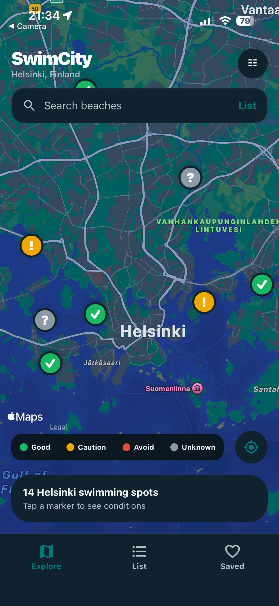

# SwimCity

SwimCity is an Expo app for discovering Helsinki swimming spots. It puts City of Helsinki observations, water temperature, algae information, and data freshness where they are easy to compare.

> SwimCity is an active side project and work in progress. It is not an official safety service or a substitute for City guidance.

## Screenshots

### iOS

### Android

_Coming soon._

### Web

_Coming soon._

## Features

- Interactive Helsinki maps on native and web, with textual good/caution/avoid/unknown marker descriptions.
- Search, practical amenity filters, list/map navigation, and best/nearest/warmest sorting.
- Detail views for conditions, amenities, accessibility, lifeguard seasonality, freshness, favorites, and directions.
- Local favorites with AsyncStorage; location is requested only for nearby and nearest experiences.
- Light and dark themes, plus loading, empty, and API-error states.

## Architecture

\`\`\`text
app/ Expo Router screens and navigation
components/ Presentational, accessible UI primitives
features/swimming-spots/ Pure condition and sorting/filtering domain logic
services/api/ City catalog and condition-provider contracts
stores/ Persisted Zustand state
types/ + theme/ Normalized model and shared visual tokens
\`\`\`

The normalized \`SwimmingSpot\` model isolates external source shapes. \`CityCatalogProvider\` and \`ConditionsProvider\` keep a future Oslo or Stockholm provider as a data-layer addition rather than a screen rewrite.

## Tech stack

- Expo SDK 57, React Native, TypeScript, and Expo Router
- \`react-native-maps\` on iOS/Android; React Leaflet + Leaflet on web
- TanStack Query, Zustand, AsyncStorage, Expo Location, and Expo Linking
- Jest and React Native Testing Library

## Data sources and attribution

### City of Helsinki Service Map

SwimCity queries the public City of Helsinki Service Map v2 beach service (\`service=731&include=observations\`) for its catalogue, coordinates, descriptions, amenities, accessibility text, lifeguard-season information, water temperature, algae observations, and official notices.

Service Map data is available under [CC BY 4.0](https://www.hel.fi/palvelukarttaws/restpages/index_en.html). **City of Helsinki Service Map** is named in the app and must remain credited as the administrator of data extracted from the API. The City does not guarantee the API's accuracy or availability.

The catalogue applies an additional multilingual beach-identity check (\`uimaranta\`, \`badstrand\`, or \`beach\`) so unrelated entries returned by the service, such as Cafe Kobben, do not appear as swimming spots.

### Web map tiles

The web map uses [Leaflet](https://leafletjs.com/) with standard [OpenStreetMap](https://www.openstreetmap.org/copyright) tiles and visible in-map attribution. Standard OSM tiles are appropriate for this portfolio MVP, but have no SLA; a production launch should select a provider sized for its traffic and follow the [OpenStreetMap tile usage policy](https://operations.osmfoundation.org/policies/tiles/).

### UiRaS

[UiRaS](https://uiras.fvh.io/) is **not used by the current app**. It remains a potential future temperature fallback, but SwimCity does not use it in production because an explicit data licence suitable for this reuse could not be established during the project audit.

## Conditions and freshness

SwimCity calculates a summary from available City data; it is not an official safety classification.

- **Avoid:** a current explicit avoidance notice, poor quality, or abundant/very abundant algae.
- **Caution:** a current official caution notice, satisfactory quality, or a small algae amount.
- **Good:** favourable quality evidence and no algae, with no current warning.
- **Unknown:** missing core signals or signals more than 72 hours old.

Favourable signals remain eligible for a good status through **72 hours**. They are labelled fresh through 24 hours and aging from 24–72 hours; SwimCity does not turn an otherwise favourable beach yellow solely because its information is aging. Signals older than 72 hours, missing, or expired are not treated as current.

When the City has not supplied a usable water-quality category but a current algae observation reports none or a small amount, SwimCity derives a quality estimate and labels it **“Good (based on algae)”**. This is not presented as an official laboratory water-quality result. A small algae amount still produces caution.

## Seasonality and limitations

City monitoring and lifeguard service are seasonal. SwimCity shows “No recent observations” or “Not currently in season” rather than treating missing seasonal information as an API failure. Lifeguard dates and hours are extracted only from recognizable City notices; otherwise the app asks people to check City information.

The native map works in Expo Go without extra setup. A standalone Android build needs its own Google Maps SDK/API-key configuration before an app-store release; that configuration is intentionally not committed to this repository.

Fixtures are available only for tests and explicit offline development with \`EXPO_PUBLIC_SWIMCITY_DATA_MODE=fixtures\`. They are never silently merged with live results.

## Run locally

Prerequisites:

- Node.js 22.13 or newer
- npm (bundled with current Node.js releases)

\`\`\`bash
npm install
npm start
\`\`\`

Run a specific platform:

\`\`\`bash
npm run ios
npm run android
npm run web
\`\`\`

Use Expo Go for device testing. For a standalone Android build, configure a restricted Google Maps key outside the repository first.

## Testing

\`\`\`bash
npm run typecheck
npm test
\`\`\`

Tests cover condition precedence and freshness, sorting/filtering, Service Map normalization, fixture separation, accessible status copy, favorites, and safe detail navigation.

## Future improvements

- Add verified screenshots and a short demo GIF.
- Add a dedicated attribution/settings surface and localized Finnish/Swedish copy.
- Revisit UiRaS only after its reuse licence is confirmed.
- Add city providers for Oslo and Stockholm without introducing city selection yet.
